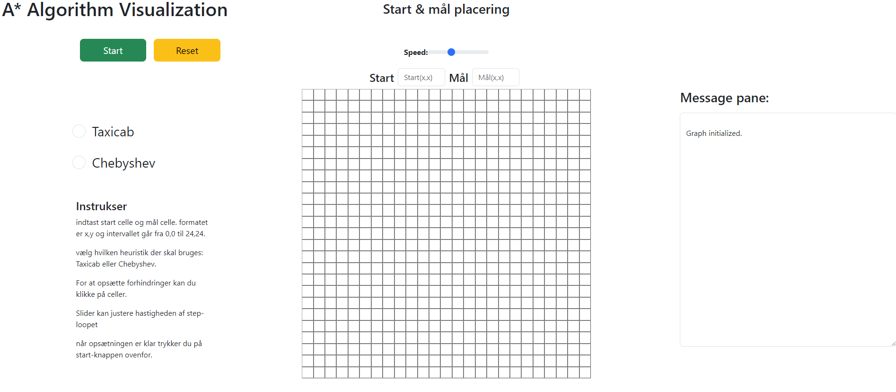
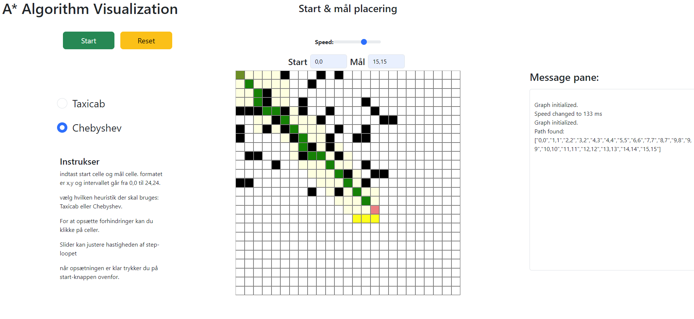

# Repo for data structures & algorithm exam
Repositoriet skal indeholde en README.md med samme information som
forsiden af rapporten:
- Et screenshot af den kørende applikation
- En kort beskrivelse for “almindelige mennesker”
- Et link til den deployede udgave.

README.md må også indeholde informationer om de anvendte
algoritmer og datastrukturer, og beskrivelser af hvordan man kan køre
visualiseringen lokalt.
# DSA: en interaktiv, visuel implementering af A*-algoritmen

## udarbejdet af:
Morten Gislund og Jacob Tobias Kristensen

## beskrivelse:
dette er en visualisering af A*-algoritmen i et 2D grid.
Det er muligt selv at vælge start og goal node, samt at tilføje vægge i form af forhindringer. 
Slideren over gridet kan justere hastigheden af visualiseringen.
Algoritmen finder den korteste vej fra start node med farven `#6b8e23` til mål noden med farven  `#f08080`.  Algoritmen søger aktivt fra den nuværende node og beregner omkostningen for hver af dens naboer frem mod mål-noden. disse naboer i det åbne set visualiseres i gul (`#ffff00`), når næste step starter skifter de evaluerede naboer farve til lysegul (`#ffffe0`), og nye naboer tilføjes og evalueres. Hvis algoritmen ikke finder en vej til mål cellen returneres et tomt array. dette er ikke visualiseret. hvis algoritmen finder en vej til mål-cellen farves denne sti grøn (`#008000`)

## this code is live at:
[This Awesome Site, Github Pages(insert correct link)](https//github.com/)
